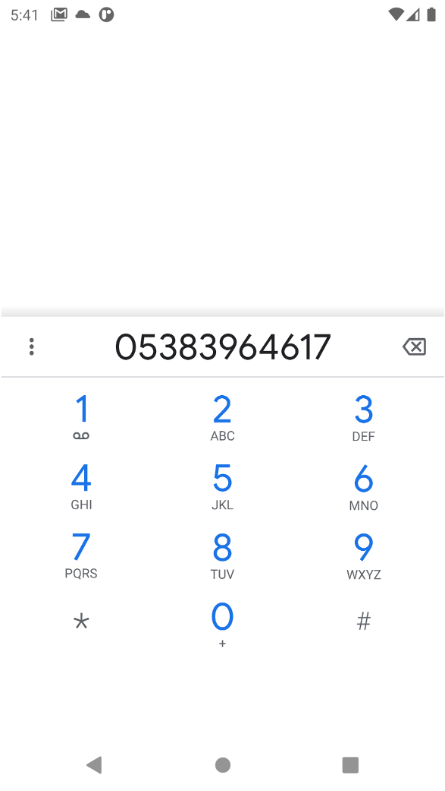

## Berber Randevu Uygulaması (Android-Firebase)

- Berber randevu uygulasi java ile kodlanmıştır ve firebase işlemleri gerçekleştirilmiştir.

- Müşteriler hesaplarıyla giriş yapıp randevu alabilmektedir.

- Firebase login/register   ve storage işlemleri ile çalışan birOuygulamadır.

- Tasarımı Adobe xd ile kullanılarak yapılmıştır.

